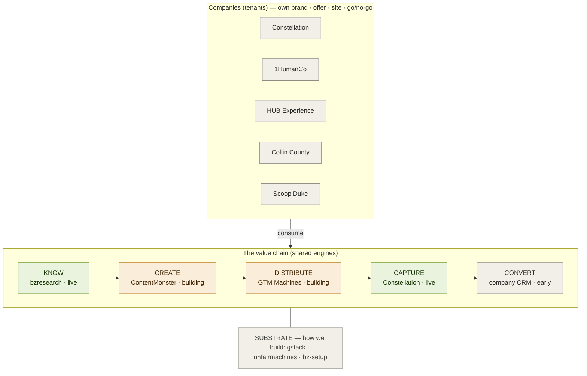

# Empire Operating Model — PROPOSED

> **Scope:** empire-wide (all Woodford/Brad companies + shared tooling), **not** ContentMonster-only.
> **Status:** 🟡 **PROPOSED DRAFT — not ratified.** Drafted 2026-06-28 from a read-only cross-repo
> mapping; awaiting Brad's go/no-go **and** a decision on where the *canonical* version should live
> (see §9). Until ratified, this is a proposal for review, not authoritative canon.
> **Home is provisional:** it sits in ContentMonster's `docs/core-charter/` only because that's the
> repo it was drafted in. Candidate permanent homes: a top-level empire doc, `bzbrain` (the
> designated shared-knowledge organ), or an extension of `bzresearch/ROUTER.md` (with Sherlock).
> **Evidence:** repo facts below come from a 2026-06-28 read-only recon of `~/Projects`; details for
> `gtmmachines`, `bzresearch`, and `constellation` should be confirmed with their owners.

---

## 1. The problem this solves

Brad's companies are **vertical** — one repo each (Constellation, 1HumanCo, HUB Experience, Collin
County, Scoop Duke, …). But the capabilities every company needs — distribution, SEO, HyperFrames
video, social channels, lead-gen — are **horizontal**. Today there's no agreed answer to *"which
project/agent owns this task?"* The trigger case: **"set up a YouTube channel for Constellation"** —
strategy lives in bzresearch, video render in ContentMonster, distribution in GTM Machines, brand in
Constellation, and the channel is *for* a company. No single owner → confusion.

## 2. The model in one line

**Companies are tenants. Capabilities are shared engines.** A company owns its brand, offer, site,
and go/no-go; it **consumes** horizontal engines rather than rebuilding them. The engines line up on
one value chain the empire already describes in its own docs:

**know → create → distribute → capture → convert** (on a shared build substrate).

## 3. The layers (engine ownership)

| Layer | Owner repo | Owns | Status | Load-bearing constraint |
|---|---|---|---|---|
| **KNOW** — doctrine / knowledge / routing | `bzresearch` (→ `bzbrain` as the future extracted organ) | SEO/AEO/AI-visibility doctrine, audit-findings pipeline, source-of-truth, the ROUTER | 🟢 live | **Sole** doctrine store — no competing knowledge stores anywhere (ROUTER.md rule) |
| **CREATE** — content + video production | `contentmonster` | Multi-tenant content/video factory (HyperFrames), ad-creative + authority-content pipelines, two-pass Vision QA | 🟡 building (HyperFrames usable now via skills; engine stubbed) | Companies register as tenants in `clients/<id>/`; universal rules in `platform/` |
| **DISTRIBUTE** — outbound + channels | `gtmmachines` | Demand-gen, channel selection/sequencing, campaign orchestration, **+ channel standup/operation** (proposed) | 🟡 building (console live; public engine + channel-ops unbuilt) | Cross-engine asset orders shouldn't bypass Brad-mediated seams (§6) |
| **CAPTURE** — inbound / search | `constellation` (app + bzresearch doctrine) | Get-found / stay-found / search-to-sale; Readiness Reports + Punch Lists to clients | 🟢 live (runconstellation.com) | Brad mediates **all** Sherlock ↔ dev-team (Archie/Fred/Felix/Henry) comms |
| **CONVERT** — sales / revenue close | per-company CRM | Turning captured demand into closed revenue | ⚪ early | GTM's Relationship-OS console is the nearest shared surface |
| **SUBSTRATE** — how we build | `gstack` + `unfairmachines` + `bz-setup` skill | Build harness, monorepo foundation, scaffolding | 🟢 live | Orthogonal to capabilities; build-state never mixes into charter/doctrine |

## 4. The routing map (the practical payoff)

| When the job is… | Talk to (owner) |
|---|---|
| Write/evolve SEO·AEO·AI-visibility doctrine or any reusable playbook | **bzresearch** (KNOW) via Sherlock — never a competing store |
| Produce a video, ad creative, or authority/lead-magnet asset for a company | **ContentMonster** (CREATE) — register the company as a `clients/<id>/` tenant, run the pipeline |
| Set up / run a social channel (YouTube, X, LinkedIn) for a company | **GTM Machines** (DISTRIBUTE) — orders renders from ContentMonster, pulls brand from the tenant, logs strategy in bzresearch |
| Generate outbound demand / run a campaign / pick channels | **GTM Machines** (DISTRIBUTE) → hands qualified demand to CAPTURE |
| Run an SEO / AI-visibility audit + deliver to a paying client | **Constellation** (CAPTURE) — dev team; doctrine flows from bzresearch via Brad-mediated briefs |
| Register a new company as a content tenant / set its brand rules | **ContentMonster** — add `clients/<id>/`; destination rules in `platform/` |
| Stand up a new company / marketing site / repo properly | **Substrate** — `bz-setup` + gstack, reusing the unfairmachines foundation |
| Track build-process state (plan/review/test/ship/handoff) | **gstack** (`/gstack-*`) in that repo |
| Capture a cross-company learning so it compounds | **bzresearch** audit-findings → doctrine (destined for bzbrain) |
| Recency / demand research on a topic | Brad invokes `/last30days`; deeper research → bzresearch |
| Can't place a task? | Map it to a verb: KNOW=bzresearch · CREATE=ContentMonster · DISTRIBUTE=GTM Machines · CAPTURE=Constellation · CONVERT=company CRM · build-it=substrate. If it's about a specific company's brand/offer/go-no-go, the **company** owns the decision and consumes the engine. |

## 5. What a company (tenant) owns vs consumes

- **Owns:** its brand/voice/offer, its own site/app, domain decisions, go/no-go on outward-facing or
  irreversible actions.
- **Consumes:** CREATE (registers in ContentMonster for assets), DISTRIBUTE (hands channels to GTM
  Machines to stand up + run), CAPTURE (sells via Constellation's product or its own CRM), KNOW
  (follows bzresearch doctrine).
- **Does NOT build:** its own video pipeline, channel-ops, or doctrine store — it requests them from
  the engine that owns that horizontal.

## 6. Current state vs target (honest)

This model is the empire's stated architecture **made explicit** — ~80% already true in the repos'
own charters. Two things are target-state, not wired:

- **CREATE is a scaffold.** ContentMonster's engine logic is typed stubs with no AI/render SDKs
  installed — **but HyperFrames works today as installed skills**, so production is possible now
  ahead of the factory being built.
- **The CREATE→DISTRIBUTE seam is aspirational.** GTM Machines currently treats ContentMonster as
  "no active integration." The handoff is a decision, not an existing wire.

**The one true gap: social-channel operation.** Nobody owns *"stand up + run a channel for company
X."* This model nominates GTM Machines (DISTRIBUTE), which has not built cross-company channel-ops.

**Other watch-items:** `bzbrain` (the designated shared-knowledge organ) is still a placeholder,
built in-place inside bzresearch; and 5+ repos independently build Next.js+Vercel marketing sites
with no shared "sites" engine (`unfairmachines` is the foundation but carries no web-property
capability yet).

## 7. Constraints this model honors (existing canon)

1. **bzresearch is the only doctrine store** — engines consume doctrine, never duplicate it.
2. **Brad mediates all Sherlock ↔ Constellation-dev-team communication** — cross-engine handoffs that
   touch the dev team or doctrine go through Brad (the unresolved "Brad-as-bottleneck" question: a
   narrow, audited direct handshake for *routine asset orders* could be authorized later — §8).
3. **No rebuilt Brief Router** — the June-10 "seam dissolution" deliberately collapsed the old
   two-repo brief pipeline; don't re-introduce it.
4. **Lane separation** — build-state → gstack; what-we-build → charter/doctrine; substrate stays
   orthogonal to capabilities.
5. **Durability** — durable routing/ownership rules live in git-tracked workspace/charter files, not
   in auto-memory.

## 8. Worked example — a YouTube channel for Constellation

Ticket **CINT-W-004** (in bzresearch); strategy + brand assets (logo, colors `#050505 / #F5F5F5 /
#FF2B2B`, Geist, a 60s narration + storyboard) are **already ready**.

| Step | Owner |
|---|---|
| 1. Decide channel name + cadence (go/no-go) | **Brad** (decision layer) — the only blocker |
| 2. Channel strategy, topics, measurement | **bzresearch** (KNOW) — already locked |
| 3. Supply brand, brief, narration, storyboard | **Constellation** (tenant) — assets ready |
| 4. Produce the videos (HyperFrames + QA) | **ContentMonster** (CREATE) — renderable now via skills |
| 5. Create + brand the channel, schedule, publish | **GTM Machines** (DISTRIBUTE) — to build |
| 6. Wire attribution, feed the funnel | **GTM Machines** → **Constellation** (CAPTURE) — to build |
| 7. Log outcomes back into doctrine | **bzresearch** (KNOW) — pipeline exists |

**Net:** the chain is ready end-to-end except steps 5–6; the immediate unblock is Brad's name +
cadence call, after which the first videos can be produced now.

## 9. Open decisions (for Brad)

1. **Ratify the model** (know/create/distribute/capture/convert + companies-as-tenants) and confirm
   **ContentMonster = the CREATE engine** — this unblocks re-scoping ContentMonster's charter to the
   authority-content pivot.
2. **Channel-ops ownership** — build it into GTM Machines as a shared capability, or keep channels
   per-company for now.
3. **Canonical home for this doc** — top-level empire doc vs `bzbrain` vs extend `bzresearch/ROUTER.md`
   (likely with Sherlock). *Deliberately left to Brad.*
4. **CREATE→DISTRIBUTE seam** — wire it now, or stage until ContentMonster has a working pipeline.
5. **Brad-mediation vs. audited direct handshake** for routine engine-to-engine asset orders (the
   "Brad-as-bottleneck" question).
6. *(Optional)* **A shared "sites" engine** (reusing unfairmachines) vs. per-company marketing sites.

## Changelog
- 2026-06-28 — Drafted from a read-only cross-repo mapping (15 repos under `~/Projects`). Proposed,
  not ratified. Triggered by the "which project owns the Constellation YouTube channel?" question and
  the kill of the book-publishing-on-Amazon idea (which re-scoped ContentMonster's 2nd pipeline to
  authority content — an instance of the CREATE layer).
